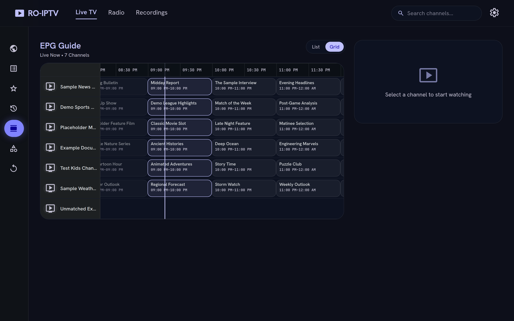
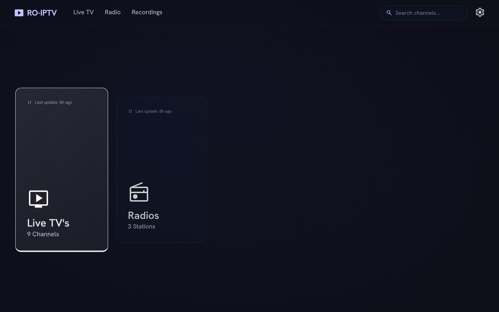
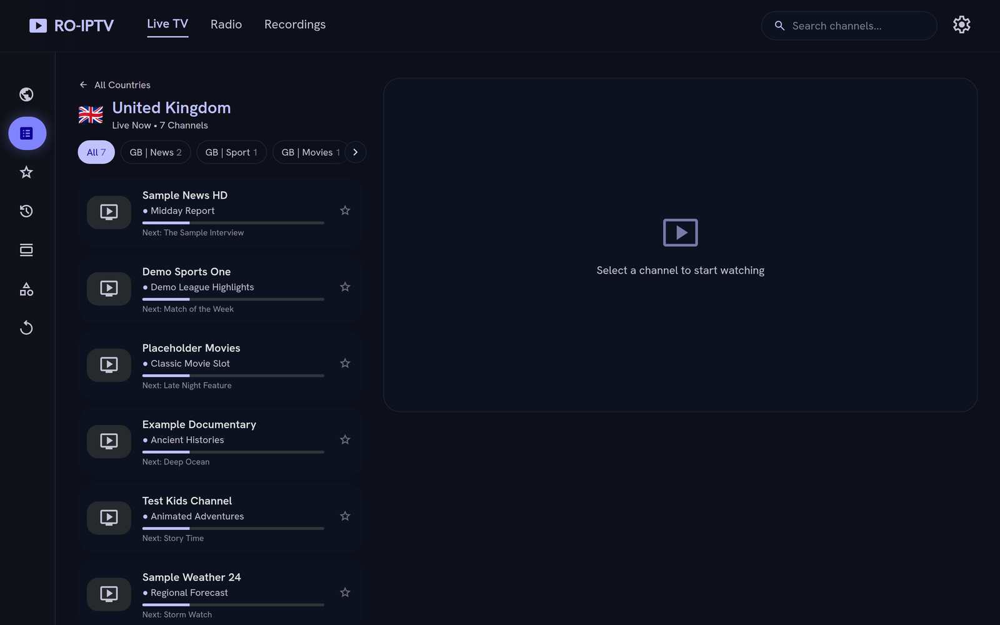
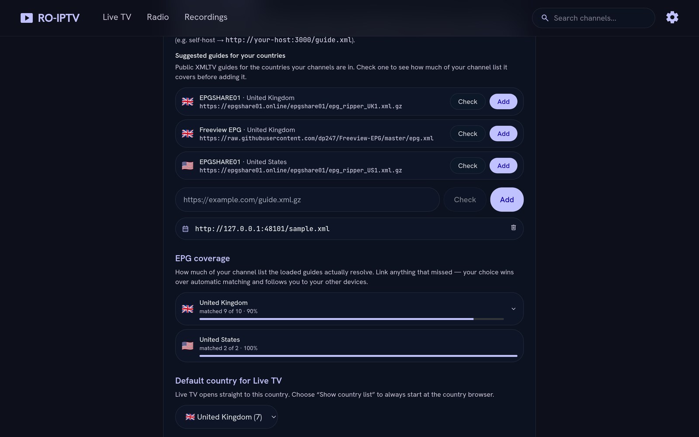
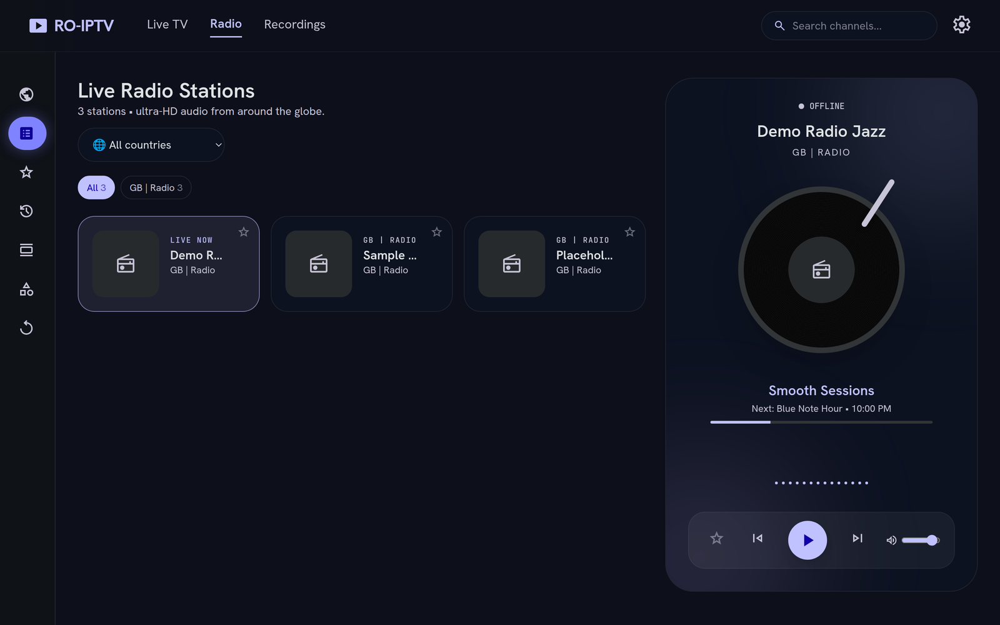

# RO-IPTV

A self-hosted **M3U / IPTV player** as an installable **Progressive Web App** — Live TV, Radio, EPG and Recordings, packaged as a **single Docker image**.

Built with React + TailwindCSS + HLS.js on the front end and a Node/Express backend that handles M3U parsing, XMLTV EPG, a CORS-bypassing stream proxy, and JSON persistence.

 



<table>
  <tr>
    <td width="50%"><br><em>Home — pick up where you left off</em></td>
    <td width="50%"><br><em>Live TV — Now/Next on every channel</em></td>
  </tr>
  <tr>
    <td><br><em>Guides suggested per country, with coverage you can see</em></td>
    <td><br><em>Radio — with live track info</em></td>
  </tr>
</table>

<sub>Screenshots use a sample playlist and a synthetic guide — the channel and programme names shown are invented.</sub>

---

## ✨ Features

- **Authentication** — optional username/password login (enable by setting `AUTH_PASSWORD`). A bootstrap `admin`/`admin` credential **forces a password change on first login**; the new password is stored salted + scrypt-hashed in the `/data` volume, retiring the default. HttpOnly signed-cookie sessions, "Remember Password", brute-force rate limiting, and a **Settings → Account** password change. See [Authentication](#-authentication).
- **Playlist management** — load M3U/M3U8 from URL or file upload; parses `group-title`, `tvg-logo`, `tvg-id`, `tvg-name`. Multi-playlist support with enable toggles, per-playlist Live/Radio routing, last-updated timestamps, configurable auto-refresh, and original-file download. Stored in `localStorage` **and** server-side JSON.
- **Channel browsing** — **browse by country** for large (5000+) lists, category chips with counts, real-time search, logo fallbacks, **Now/Next** EPG labels, favourites (red ★) and watch history. Set a default country for Live TV.
- **Player** — HLS.js for `.m3u8`, native `<video>`/`<audio>` for direct streams. A **draggable, resizable floating mini-player** (in-app PiP) keeps playback alive as you navigate, plus native Picture-in-Picture and **OS / lock-screen media controls** (Media Session with play/pause and previous/next). Remembers your last-watched channel; on mobile the player stays pinned while you scroll.
- **EPG** — the server owns the guide: it fetches every configured XMLTV source (plain or gzipped) on a schedule, parses once, and keeps it on disk, so Now/Next is warm at first paint and survives a restart. Read it as **cards or as a time grid** (channels down, half-hourly axis across, live "now" line, click to record, pan back into catchup). Guides are matched to channels by `tvg-id`, then by name, then by iptv-org alternative names, with a manual **Link EPG** override that wins over all of them.
- **Guides without the guesswork** — Settings suggests known public XMLTV sources **for the countries your channels are actually in**, and checks a candidate before you add it: *"matches 143 of your 168 channels"*. An **EPG coverage** card then shows what resolved per country, lists what didn't, and lets you link those by hand.
- **Precision EPG (optional)** — a [sidecar](#precision-epg-optional-sidecar) that grabs a guide for *exactly your channels* instead of a whole country pack. RO-IPTV generates the channel list itself from your playlists; no mapping to write.
- **Radio mode** — stations auto-detected (`group-title`, `radio`/`fm`/`am`), a genre grid and an animated player with background-safe playback. Stations join the guide like any other channel, and where a station carries no guide the player reads **ICY now-playing** straight off the stream — the live track and the station's real bitrate, on screen and on the lock-screen media card.
- **Recordings** — **real server-side capture to disk with ffmpeg** (stream-copied to a fragmented MP4 so it's instantly seekable), with a per-recording duration cap, live file size, in-app playback and download, and persistence across restarts/rebuilds. Start a capture live or schedule one from the EPG.
- **PWA** — installable on mobile/desktop/TV, offline app shell, cache-first logos & EPG, background playlist refresh, offline fallback page, and an "Add to Home Screen" prompt. Fonts are **self-hosted**, so the UI renders identically offline and no third party sees a request for every page view.
- **Security** — hardened single image (non-root, read-only root FS, all caps dropped) plus CSP, HSTS, `Permissions-Policy`, API rate limiting, upload sanitization and a `make scan` CVE gate. See [Security](#-security).
- **Extras** — Open-Meteo weather widget (auto-location), clock/date, lazy loading for 1000+ channel lists, built-in CORS stream proxy.

---

## 🚀 Quick start (Docker)

**Pull the prebuilt image — no build needed.** It's a multi-arch image, so the
right build for your hardware (Intel/AMD `amd64` or ARM `arm64` — Synology, Pi,
mini-PC, server…) is selected automatically.

```bash
docker run -d --name ro-iptv -p 56892:56892 \
  -v ro-iptv-data:/data \
  -e TZ=Europe/London \
  -e AUTH_PASSWORD=admin \
  --read-only --tmpfs /tmp --cap-drop ALL --security-opt no-new-privileges \
  ghcr.io/aiulian25/ro-iptv:latest
```

…or with **Docker Compose** — grab [`docker-compose.yml`](docker-compose.yml)
from this repo (it already pulls the published image, with hardening and
sensible defaults) and run:

```bash
docker compose up -d            # start
docker compose pull && docker compose up -d   # later: update to the latest image
```

Then open **http://localhost:56892**

> 🔐 **First login:** if you set `AUTH_PASSWORD` (the sample `.env` ships `admin`/`admin`), sign in with those credentials — the app then **forces you to set a new password** before continuing, and the default stops working. Leave `AUTH_PASSWORD` empty to run without a login.

That's the whole thing — a **single image** where one Express process serves both the API and the built PWA on port **56892**. No separate Nginx container. Playlists, recordings (and their captured files), and the auth credential persist in the `data` Docker volume.

### Build from source (optional)

End users don't need this — pull the image above. To build it yourself, use the
build compose file:

```bash
docker compose -f docker-compose.build.yml up -d --build
```

### Precision EPG (optional sidecar)

Public XMLTV packs are per-country: you get a guide for everything in Romania,
whether or not you have those channels — and nothing for the ones you have that
the pack missed. The optional sidecar flips that around. RO-IPTV writes a
`channels.xml` listing **only the channels you actually have**, each mapped to
the grabber site that carries it (via the [iptv-org](https://github.com/iptv-org/epg)
dataset), and the official grabber fetches exactly those.

It lives in the same compose file, behind a profile — add `--profile epg` to turn
it on:

```bash
docker compose --profile epg up -d
```

That's it — no mapping to write, no URL to paste. The app keeps the list in step
with your playlists, regenerates it daily, and registers the resulting guide as
an EPG source automatically. Leave the profile off and nothing changes.

```bash
docker compose logs -f ro-iptv          # "channels.xml → 94/168 channels mapped"
curl -s localhost:56892/api/epg/sidecar | jq   # what was mapped, and what wasn't
```

**Hardware note:** the grabber loads the whole iptv-org dataset into memory
before it fetches anything, so it needs roughly **8 GB of RAM available during
startup** (it settles to ~110 MB afterwards). On a Pi or a small VPS it will exit
with `JavaScript heap out of memory` and never produce a guide — there, use the
public per-country guides from **Settings → EPG sources** instead, which need
nothing but the app.

Requires Docker Engine ≥ 26 / Compose ≥ 2.24 for the `subpath` volume option; the
compose file documents the bind-mount fallback for older versions. The grabber
publishes no host port — only the app can reach it. If you run with
`PROXY_BLOCK_PRIVATE=1`, the sidecar's exact URL is allow-listed while every
other private address stays blocked.

---

## 🧑‍💻 Local development

Requires Node.js 20+.

```bash
npm run install:all          # install client + server deps

# terminal 1 — backend on :56892
npm run dev:server

# terminal 2 — Vite dev server on :5173 (proxies /api to :56892)
npm run dev:client
```

Open http://localhost:5173. To preview the production build served by Express:

```bash
npm run build && npm start    # http://localhost:56892
```

---

## ⚙️ Configuration

| Variable                   | Default             | Description                                            |
| -------------------------- | ------------------- | ------------------------------------------------------ |
| `PORT`                     | `56892`             | Port the app (API + frontend) listens on.              |
| `TZ`                       | `Europe/London`     | Container timezone (clock / EPG times).                |
| `M3U_URL`                  | _empty_             | Optional playlist auto-loaded on first launch.         |
| `EPG_URL`                  | _empty_             | Optional XMLTV EPG URL for the guide & Now/Next.       |
| `REFRESH_INTERVAL_MINUTES` | `360`               | Active-playlist auto-refresh interval (`0` disables).  |
| `RECORDING_MAX_MINUTES`    | `180`               | Hard cap on a single recording's length.               |
| `RECORDINGS_MAX_GB`        | _empty_             | Optional total-storage cap; prunes oldest finished.    |
| `DATA_DIR`                 | `/data`             | Where playlists, recordings, guides & auth data are persisted. |
| `MEM_LIMIT` / `NODE_HEAP_MB` | `2g` / `1536`     | Container memory and node's heap ceiling. A country EPG pack is ~13 MB gzipped but ~72 MB of XML, and parsing it peaks near 900 MB — node claims only about half a cgroup limit on its own, so both are set explicitly. |
| `EPG_SIDECAR_URL`          | _empty_             | Guide served by the optional grabber sidecar; set for you by `--profile epg`. |

> Authentication and security-hardening variables are documented in their own
> sections below ([Authentication](#-authentication), [Security](#-security)).

**Set these via environment variables** (e.g. `-e VAR=value` on `docker run`, or
the `environment:` block in Compose). For a full, commented reference of every
option — including authentication and hardening — copy the sample file and edit it:

```bash
cp .env.example .env     # then set your values and pass it to the container
```

The playlist/EPG/refresh options are also editable at runtime from the in-app
**Settings** dialog.

---

## 🔐 Authentication

Authentication is **enabled when `AUTH_PASSWORD` is set** and disabled (open) when
it's empty — so a quick trial needs no login, while a real deployment is protected.

**Bootstrap → stored credential.** The env credentials act as a one-time bootstrap:
the first login forces a password change, and the new password is stored as a
salted **scrypt** hash in `/data/auth.json`. After that the env credentials no
longer work. Change it again anytime from **Settings → Account**.

| Variable             | Default | Description                                                        |
| -------------------- | ------- | ------------------------------------------------------------------ |
| `AUTH_USERNAME`      | `admin` | Login username.                                                    |
| `AUTH_PASSWORD`      | _empty_ | Bootstrap password. Set it to require login; empty = open.         |
| `AUTH_SESSION_DAYS`  | `30`    | How long a "Remember Password" session lasts.                      |
| `AUTH_SESSION_SECRET`| _empty_ | Pin the token-signing secret (else auto-generated in `/data`).     |
| `RL_LOGIN_MAX`       | `10`    | Max login attempts per IP per 15 min (brute-force protection).     |

Sessions use an HttpOnly, SameSite=Lax, signed cookie (`Secure` automatically on
HTTPS). **Lost the password?** Delete the `credential` entry from
`/data/auth.json` and restart — the app falls back to the bootstrap login.

---

## 🔒 Security

The image and app are hardened out of the box — non-root, read-only root
filesystem, all Linux capabilities dropped, `no-new-privileges`, resource/PID
limits, npm removed, OS packages patched on build, plus a tuned CSP, HSTS,
`Permissions-Policy`, API rate limiting and upload sanitization. Behind a reverse
proxy, terminate TLS at the proxy and forward to port 56892.

Optional hardening variables (see [`.env.example`](.env.example)):

| Variable                | Default     | Description                                              |
| ----------------------- | ----------- | ------------------------------------------------------- |
| `CORS_ALLOWED_ORIGINS`  | _empty_     | Comma-separated hosts allowed cross-origin. Empty = any.|
| `HSTS_MAX_AGE`          | `15552000`  | HSTS max-age (seconds); only honored over HTTPS.        |
| `RATE_LIMIT_DISABLED`   | _empty_     | Set `1` to turn off API rate limiting entirely.         |
| `RL_UPSTREAM_MAX`       | `120`       | Max upstream-fetch requests/min/IP (playlist/EPG/parse).|
| `RL_WRITE_MAX`          | `120`       | Max write requests/min/IP (playlist/recording changes). |
| `PROXY_BLOCK_PRIVATE`   | _empty_     | Set `1` to refuse proxy/playlist/EPG fetches to private/loopback addresses (SSRF hardening). Leave blank for LAN sources. |
| `MEM_LIMIT` / `CPU_LIMIT` / `PIDS_LIMIT` | `1024m` / `2` / `256` | Container resource ceilings (compose). |

Run the image vulnerability scan suite (Trivy, Grype, hadolint, syft SBOM) with
`make scan` after `make build`.

---

## 🔌 Backend API

| Method   | Endpoint                | Purpose                                       |
| -------- | ----------------------- | --------------------------------------------- |
| `GET`    | `/api/health`           | Health check (public).                         |
| `GET/POST` | `/api/auth/*`         | `status`, `login`, `logout`, `password` (public).|
| `GET`    | `/api/config`           | Server-provided defaults (M3U/EPG/refresh).   |
| `ALL`    | `/api/proxy?url=`       | CORS / range-aware stream + manifest proxy.   |
| `GET`    | `/api/playlist?url=`    | Fetch + parse an M3U into channels.           |
| `POST`   | `/api/parse`            | Parse raw M3U text (file uploads).            |
| `GET`    | `/api/epg?url=`         | Fetch + parse one XMLTV guide (ad-hoc URLs).   |
| `GET`    | `/api/epg/merged`       | Every configured source, merged and windowed — what the app reads. |
| `GET`    | `/api/epg/health`       | Per-source status of the last refresh.        |
| `GET`    | `/api/epg/channels`     | The channels this install has, with their countries. |
| `GET`    | `/api/epg/coverage`     | How much of your channel list the guides resolve. |
| `GET`    | `/api/epg/suggest`      | Known public guides for your countries.       |
| `POST`   | `/api/epg/validate`     | Try a guide URL and report how much it covers. |
| `GET`    | `/api/epg/altnames`     | Alternative channel names used for matching.  |
| `GET`    | `/api/epg/sidecar`      | Generated channel list + whether the grabber is live. |
| `GET`    | `/api/nowplaying?url=`  | ICY now-playing for a radio stream.           |
| `GET/POST/DELETE` | `/api/playlists` | Playlist metadata + raw-file storage.      |
| `GET/POST/DELETE` | `/api/recordings`| Recordings: start/stop, schedule, file stream/download. |
| `GET/PUT` | `/api/state/:key`      | Cross-device sync of favourites/history/settings. |

When authentication is enabled, every `/api/*` route **except** `/api/health` and
`/api/auth/*` requires a valid session cookie (returns `401` otherwise). The
`/api/proxy` endpoint rewrites HLS manifests so nested playlists/segments also
flow through the proxy — letting you play streams from any origin regardless of
their CORS headers.

---

## 🗂️ Project structure

```
.
├── client/                 # React + Vite + Tailwind PWA
│   ├── src/
│   │   ├── components/      # TopNav, players, mini-player, login brand mark, etc.
│   │   ├── views/          # Home, Live, Radio, Recordings, Settings, Login, ChangePassword
│   │   ├── store/          # Zustand store (auth, playlists, favourites, history…)
│   │   ├── hooks/          # weather, clock, Media Session, floating PiP window
│   │   ├── lib/            # api, m3u + epg parsing, country helpers
│   │   └── fonts.css       # self-hosted webfaces (generated, see Fonts below)
│   └── public/             # manifest icons, favicon, offline page, fonts/
├── server/                 # Express API + static host
│   ├── lib/                # auth, json store, ffmpeg recorder, http guards
│   │                       #   channels   — the channels this install has
│   │                       #   epgstore   — fetch/persist/merge the guides
│   │                       #   epgsources — known public guide providers
│   │                       #   epgmatch   — channel ↔ guide matching
│   │                       #   iptvorg    — iptv-org dataset (sidecar mapping)
│   │                       #   channelsxml— generates the grabber's channel list
│   │                       #   icy        — radio now-playing over ICY
│   └── test/               # node:test suites (`npm test`, no extra deps)
├── screenshots/            # README images (sample data only)
├── Dockerfile              # multi-stage: build client → hardened Express runtime
├── docker-compose.yml      # ready-to-deploy (sidecar via --profile epg)
├── docker-compose.build.yml# build from source (sidecar via --profile epg)
├── Makefile                # build/release + `make scan` (Trivy/Grype/hadolint/SBOM)
└── .env.example
```

### Fonts

`client/public/fonts/` and `client/src/fonts.css` are generated from Google Fonts
and committed, rather than loaded from `fonts.googleapis.com` at runtime. Three
reasons: the icon face is a **ligature** font, so with `display=swap` every launch
painted `settings`, `search`, `smart_display` as literal words until it arrived;
those icons never loaded at all offline, in an app that advertises offline use;
and a self-hosted app should not make every visitor's browser call a third party.
The icon face is subset to the ~64 symbols actually used — 39 KB instead of
2.3 MB. Licences and attribution travel with the files in
[`client/public/fonts/LICENSES.md`](client/public/fonts/LICENSES.md) (Apache-2.0
for Material Symbols, OFL-1.1 for the text faces).

---

## 📺 Using it

1. If a login appears, sign in (first run: **`admin`/`admin`**, then set your own password).
2. Open the app → **Settings** (gear icon).
3. **Add Playlist** by URL or upload an `.m3u`/`.m3u8` file.
4. Optionally paste an **XMLTV EPG URL** to enable the guide and Now/Next labels.
5. Browse **Live TV / Radio**, star favourites, and record live or from the EPG.
6. On mobile/desktop, accept the **Install** prompt to add RO-IPTV to your home screen.

---

## 📝 Notes & limitations

- **Recordings** are captured to disk by `ffmpeg` (stream-copied, no re-encode) into a fragmented MP4 and stored in the `/data` volume. Each capture is bounded by `RECORDING_MAX_MINUTES` (default 180) so it can't run unbounded; captures interrupted by a restart are marked accordingly and keep whatever landed on disk.
- Some providers block datacenter IPs or require specific `User-Agent`/referrer headers; the proxy sends a browser-like UA but can't bypass provider auth.
- This project plays content **you are authorised to access**. Bring your own legal playlist.

---

## 📄 License

[MIT](LICENSE) © aiulian25
